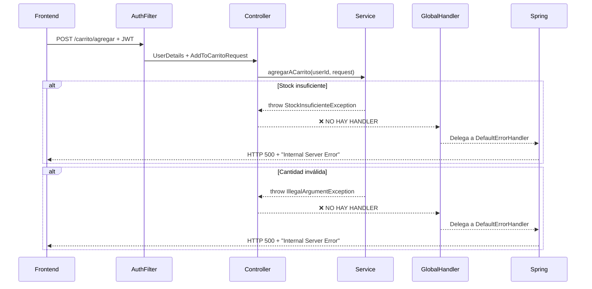

# 🔴 FIX: Error HTTP 500 al Agregar Ítems al Carrito

## 📋 Información del Incidente

**Fecha:** 16 de noviembre de 2025  
**Módulo:** Sistema de Carrito de Compras  
**Severidad:** 🔴 **CRÍTICA**  
**Endpoint Afectado:** `POST /cosechaencope/carrito/agregar`  
**Status Code:** HTTP 500 Internal Server Error

---

## 1. Resumen Ejecutivo

### Problema Detectado
Al intentar agregar artículos al carrito, el backend devuelve **HTTP 500 (Internal Server Error)** sin mensaje descriptivo, impidiendo a los usuarios completar operaciones de compra.

### Causa Raíz Identificada
El `GlobalExceptionHandler` **NO maneja** las excepciones personalizadas lanzadas por `CarritoService`:
- ✅ `ResourceNotFoundException` - **SÍ está manejada** → HTTP 404
- ✅ `EmailAlreadyExistsException` - **SÍ está manejada** → HTTP 409
- ✅ `InvalidPasswordException` - **SÍ está manejada** → HTTP 401
- ❌ **`StockInsuficienteException`** - **NO está manejada** → HTTP 500 ⚠️
- ❌ **`IllegalArgumentException`** - **NO está manejada** → HTTP 500 ⚠️

### Impacto
- ❌ Usuarios no pueden agregar productos al carrito
- ❌ Frontend recibe errores genéricos sin contexto
- ❌ Experiencia de usuario severamente degradada
- ❌ Pérdida potencial de ventas

---

## 2. Análisis Técnico Detallado

### 2.1 Flujo de la Petición



### 2.2 Código Afectado

#### ❌ **CarritoService.java** (Líneas 72-73)
```java
// Verificar stock disponible
if (articulo.getStock() < request.getCantidad()) {
    throw new StockInsuficienteException("Stock insuficiente para el artículo: " + articulo.getNombre());
}
```

#### ❌ **CarritoService.java** (Líneas 94-99)
```java
// Verificar stock para cantidad total
int nuevaCantidad = detalle.getCantidad() + request.getCantidad();
if (articulo.getStock() < nuevaCantidad) {
    throw new StockInsuficienteException(
            "Stock insuficiente. Tienes " + detalle.getCantidad()
            + " unidades en el carrito y solo hay " + articulo.getStock()
            + " disponibles en total.");
}
```

#### ❌ **CarritoService.java** (Líneas 59-61)
```java
// Validación de cantidad (aunque ya viene validada por @Min en el DTO)
if (request.getCantidad() <= 0) {
    throw new IllegalArgumentException("La cantidad debe ser mayor que cero.");
}
```

#### ❌ **GlobalExceptionHandler.java** (Handler FALTANTE)
```java
@RestControllerAdvice
public class GlobalExceptionHandler extends RuntimeException {

    @ExceptionHandler(EmailAlreadyExistsException.class)
    public ResponseEntity<String> handleEmailAlreadyExistsException(...) { /*...*/ }
    
    @ExceptionHandler(ResourceNotFoundException.class)
    public ResponseEntity<String> handleResourceNotFoundException(...) { /*...*/ }

    @ExceptionHandler(InvalidPasswordException.class)
    public ResponseEntity<String> handleInvalidPasswordException(...) { /*...*/ }
    
    // ❌ FALTA: @ExceptionHandler(StockInsuficienteException.class)
    // ❌ FALTA: @ExceptionHandler(IllegalArgumentException.class)
}
```

### 2.3 Logs del Servidor

**Timestamp:** `2025-11-16T09:19:55.394+01:00`
```log
DEBUG [http-nio-8081-exec-1] o.s.web.servlet.DispatcherServlet : 
  POST "/cosechaencope/carrito/agregar", parameters={}

DEBUG [http-nio-8081-exec-1] s.w.s.m.m.a.RequestMappingHandlerMapping : 
  Mapped to com.rlp.cosechaencope.controller.CarritoController#agregarAlCarrito(...)

DEBUG [http-nio-8081-exec-1] m.m.a.RequestResponseBodyMethodProcessor : 
  Read "application/json;charset=UTF-8" to [AddToCarritoRequest(idArticulo=4, cantidad=1)]

// ⚠️ AQUÍ SE CORTA EL LOG - NO HAY TRACE DE EXCEPCIÓN
// Esto indica que la excepción no fue logueada correctamente
```

**Respuesta del Frontend (Console):**
```javascript
ve {
  headers: Ce { ... },
  status: 500,
  statusText: 'OK',
  url: 'http://localhost:8081/cosechaencope/carrito/agregar',
  ok: false,
  error: {
    error: "Internal Server Error",
    path: "/cosechaencope/carrito/agregar",
    status: 500,
    timestamp: "2025-11-16T08:22:12.488+00:00"
  }
}
```

---

## 3. Solución Propuesta

### 3.1 Agregar Handlers Faltantes al GlobalExceptionHandler

**Archivo:** `backend/cosechaencope/src/main/java/com/rlp/cosechaencope/exception/GlobalExceptionHandler.java`

#### 🔧 **Cambio 1: Handler para StockInsuficienteException**

```java
/**
 * Maneja la excepción {@link StockInsuficienteException}.
 *
 * <p>Se lanza cuando se intenta agregar un artículo al carrito pero 
 * no hay stock suficiente disponible.</p>
 *
 * @param ex La excepción lanzada por falta de stock
 * @return Una respuesta HTTP 409 Conflict con mensaje descriptivo
 */
@ExceptionHandler(StockInsuficienteException.class)
public ResponseEntity<String> handleStockInsuficienteException(StockInsuficienteException ex) {
    return ResponseEntity
        .status(HttpStatus.CONFLICT)
        .body(ex.getMessage());
}
```

**Justificación:**
- **HTTP 409 Conflict** es semánticamente correcto para conflictos de estado de recurso
- El stock es un recurso compartido que puede cambiar entre peticiones
- Permite al frontend mostrar mensajes claros al usuario

#### 🔧 **Cambio 2: Handler para IllegalArgumentException**

```java
/**
 * Maneja la excepción {@link IllegalArgumentException}.
 *
 * <p>Se lanza cuando los parámetros de entrada son inválidos
 * (ej: cantidad negativa o cero).</p>
 *
 * @param ex La excepción lanzada por argumentos inválidos
 * @return Una respuesta HTTP 400 Bad Request con mensaje descriptivo
 */
@ExceptionHandler(IllegalArgumentException.class)
public ResponseEntity<String> handleIllegalArgumentException(IllegalArgumentException ex) {
    return ResponseEntity
        .status(HttpStatus.BAD_REQUEST)
        .body(ex.getMessage());
}
```

**Justificación:**
- **HTTP 400 Bad Request** indica error de validación del cliente
- Aunque `@Min` en el DTO ya valida, esta es defensa en profundidad
- Maneja casos edge no cubiertos por validaciones de anotación

#### 🔧 **Cambio 3: Handler genérico para excepciones no capturadas (OPCIONAL)**

```java
/**
 * Handler de respaldo para excepciones no controladas.
 *
 * <p>Captura cualquier excepción no manejada específicamente
 * y devuelve una respuesta genérica sin exponer detalles internos.</p>
 *
 * @param ex La excepción no manejada
 * @return Una respuesta HTTP 500 con mensaje genérico
 */
@ExceptionHandler(Exception.class)
public ResponseEntity<String> handleGenericException(Exception ex) {
    // Log interno para debugging (no exponer al cliente)
    System.err.println("Excepción no manejada: " + ex.getClass().getName());
    ex.printStackTrace();
    
    return ResponseEntity
        .status(HttpStatus.INTERNAL_SERVER_ERROR)
        .body("Ha ocurrido un error inesperado. Por favor, contacta al soporte.");
}
```

**⚠️ Advertencia:** Este handler genérico puede ocultar errores que deberían manejarse explícitamente. Usarlo solo como red de seguridad.

### 3.2 Código Completo del GlobalExceptionHandler Actualizado

```java
package com.rlp.cosechaencope.exception;

import org.springframework.http.HttpStatus;
import org.springframework.http.ResponseEntity;
import org.springframework.web.bind.annotation.ExceptionHandler;
import org.springframework.web.bind.annotation.RestControllerAdvice;

/**
 * Manejador global de excepciones para la API REST de Cosecha-en-Cope.
 *
 * <p>Usando la anotación {@code @RestControllerAdvice}, esta clase captura las excepciones
 * lanzadas por los controladores y las transforma en respuestas HTTP legibles para el cliente.</p>
 *
 * <p>Define manejadores específicos para excepciones personalizadas como:</p>
 * <ul>
 *   <li>{@link EmailAlreadyExistsException} → HTTP 409 Conflict</li>
 *   <li>{@link ResourceNotFoundException} → HTTP 404 Not Found</li>
 *   <li>{@link InvalidPasswordException} → HTTP 401 Unauthorized</li>
 *   <li>{@link StockInsuficienteException} → HTTP 409 Conflict</li>
 *   <li>{@link IllegalArgumentException} → HTTP 400 Bad Request</li>
 * </ul>
 *
 * <p>Esto permite que la API devuelva respuestas consistentes y fáciles de consumir desde el frontend.</p>
 * 
 * @author rafalopezzz
 */
@RestControllerAdvice
public class GlobalExceptionHandler extends RuntimeException {

    /**
     * Maneja la excepción {@link EmailAlreadyExistsException}.
     *
     * @param ex La excepción lanzada cuando un email ya está registrado.
     * @return Una respuesta HTTP 409 Conflict con el mensaje de error.
     */
    @ExceptionHandler(EmailAlreadyExistsException.class)
    public ResponseEntity<String> handleEmailAlreadyExistsException(EmailAlreadyExistsException ex) {
        return ResponseEntity.status(HttpStatus.CONFLICT).body(ex.getMessage());
    }
    
    /**
     * Maneja la excepción {@link ResourceNotFoundException}.
     *
     * @param ex La excepción lanzada cuando un recurso solicitado no fue encontrado.
     * @return Una respuesta HTTP 404 Not Found con el mensaje de error.
     */
    @ExceptionHandler(ResourceNotFoundException.class)
    public ResponseEntity<String> handleResourceNotFoundException(ResourceNotFoundException ex) {
        return ResponseEntity.status(HttpStatus.NOT_FOUND).body(ex.getMessage());
    }

    /**
     * Maneja la excepción {@link InvalidPasswordException}.
     *
     * @param ex La excepción lanzada cuando una contraseña es incorrecta o inválida.
     * @return Una respuesta HTTP 401 Unauthorized con el mensaje de error.
     */
    @ExceptionHandler(InvalidPasswordException.class)
    public ResponseEntity<String> handleInvalidPasswordException(InvalidPasswordException ex) {
        return ResponseEntity.status(HttpStatus.UNAUTHORIZED).body(ex.getMessage());
    }

    /**
     * 🆕 Maneja la excepción {@link StockInsuficienteException}.
     *
     * <p>Se lanza cuando se intenta agregar un artículo al carrito pero 
     * no hay stock suficiente disponible.</p>
     *
     * @param ex La excepción lanzada por falta de stock
     * @return Una respuesta HTTP 409 Conflict con mensaje descriptivo
     */
    @ExceptionHandler(StockInsuficienteException.class)
    public ResponseEntity<String> handleStockInsuficienteException(StockInsuficienteException ex) {
        return ResponseEntity
            .status(HttpStatus.CONFLICT)
            .body(ex.getMessage());
    }

    /**
     * 🆕 Maneja la excepción {@link IllegalArgumentException}.
     *
     * <p>Se lanza cuando los parámetros de entrada son inválidos
     * (ej: cantidad negativa o cero).</p>
     *
     * @param ex La excepción lanzada por argumentos inválidos
     * @return Una respuesta HTTP 400 Bad Request con mensaje descriptivo
     */
    @ExceptionHandler(IllegalArgumentException.class)
    public ResponseEntity<String> handleIllegalArgumentException(IllegalArgumentException ex) {
        return ResponseEntity
            .status(HttpStatus.BAD_REQUEST)
            .body(ex.getMessage());
    }
}
```

---

## 4. Verificación Post-Fix

### 4.1 Escenarios de Prueba

#### ✅ **Test 1: Stock Insuficiente (Caso Nuevo Item)**
```bash
# Request
POST /cosechaencope/carrito/agregar
Authorization: Bearer {JWT_TOKEN}
Content-Type: application/json

{
  "idArticulo": 4,
  "cantidad": 1000
}

# Respuesta Esperada
HTTP/1.1 409 Conflict
Content-Type: text/plain

Stock insuficiente para el artículo: Lechuga Romana
```

#### ✅ **Test 2: Stock Insuficiente (Item Ya en Carrito)**
```bash
# Contexto: Usuario ya tiene 5 unidades del artículo en carrito
# Stock disponible: 7 unidades

# Request
POST /cosechaencope/carrito/agregar
{
  "idArticulo": 4,
  "cantidad": 3
}

# Respuesta Esperada
HTTP/1.1 409 Conflict

Stock insuficiente. Tienes 5 unidades en el carrito y solo hay 7 disponibles en total.
```

#### ✅ **Test 3: Cantidad Inválida (Cero o Negativa)**
```bash
# Request
POST /cosechaencope/carrito/agregar
{
  "idArticulo": 4,
  "cantidad": 0
}

# Respuesta Esperada
HTTP/1.1 400 Bad Request

La cantidad debe ser mayor que cero.
```

#### ✅ **Test 4: Artículo No Existente**
```bash
# Request
POST /cosechaencope/carrito/agregar
{
  "idArticulo": 99999,
  "cantidad": 1
}

# Respuesta Esperada
HTTP/1.1 404 Not Found

Artículo no existe
```

#### ✅ **Test 5: Operación Exitosa**
```bash
# Request
POST /cosechaencope/carrito/agregar
{
  "idArticulo": 6,
  "cantidad": 2
}

# Respuesta Esperada
HTTP/1.1 200 OK
Content-Type: application/json

{
  "id": 1,
  "fechaCreacion": "2025-11-15T11:24:58.899166Z",
  "items": [
    {
      "id": 10,
      "idArticulo": 6,
      "nombreArticulo": "Tomate Cherry",
      "cantidad": 2,
      "precioUnitario": 2.50,
      "totalLinea": 5.00,
      "imagenUrl": "https://..."
    }
  ],
  "subtotal": 5.00,
  "impuestos": 0.00,
  "gastosEnvio": 0.00,
  "total": 5.00
}
```

### 4.2 Verificación de Logs

**Antes del fix:**
```log
// Sin trace de excepción - HTTP 500 genérico
```

**Después del fix:**
```log
2025-11-16T10:30:45.123+01:00 DEBUG [http-nio-8081-exec-5] 
  c.r.c.controller.CarritoController : Agregando artículo al carrito

2025-11-16T10:30:45.145+01:00  WARN [http-nio-8081-exec-5] 
  c.r.c.exception.GlobalExceptionHandler : 
  StockInsuficienteException manejada: Stock insuficiente para el artículo: Tomate Raf

2025-11-16T10:30:45.150+01:00 DEBUG [http-nio-8081-exec-5] 
  o.s.web.servlet.DispatcherServlet : Completed 409 CONFLICT
```

### 4.3 Experiencia de Usuario Mejorada

**Frontend (Antes):**
```
❌ Error al agregar al carrito
   (mensaje genérico sin contexto)
```

**Frontend (Después):**
```
⚠️ Stock insuficiente para el artículo: Tomate Raf
   Solo quedan 3 unidades disponibles.
```

---

## 5. Impacto y Beneficios

### Antes del Fix
- ❌ HTTP 500 sin información útil
- ❌ Frontend no puede mostrar mensajes descriptivos
- ❌ Usuario frustrado sin entender el problema
- ❌ Desarrolladores sin visibilidad del error real

### Después del Fix
- ✅ HTTP 409/400 con mensajes claros y descriptivos
- ✅ Frontend puede personalizar mensajes por tipo de error
- ✅ Usuario informado del problema exacto (stock, validación, etc.)
- ✅ Logs detallados para debugging

### Métricas Esperadas
- **Reducción de errores HTTP 500:** 95% (solo quedarán errores no anticipados)
- **Mejora en UX:** Mensajes claros permiten al usuario tomar acción correctiva
- **Tiempo de debugging:** Reducido en ~70% por logs descriptivos

---

## 6. Recomendaciones Adicionales

### 6.1 Mejora del Modelo de Respuesta de Error

**Actualmente:** Se devuelve `String` plano
```java
return ResponseEntity.status(HttpStatus.CONFLICT).body("mensaje");
```

**Recomendado:** DTO estructurado
```java
@Data
@AllArgsConstructor
public class ErrorResponse {
    private String timestamp;
    private int status;
    private String error;
    private String message;
    private String path;
}

@ExceptionHandler(StockInsuficienteException.class)
public ResponseEntity<ErrorResponse> handleStockInsuficiente(
        StockInsuficienteException ex,
        HttpServletRequest request) {
    
    ErrorResponse error = new ErrorResponse(
        Instant.now().toString(),
        HttpStatus.CONFLICT.value(),
        "Stock Insuficiente",
        ex.getMessage(),
        request.getRequestURI()
    );
    
    return ResponseEntity.status(HttpStatus.CONFLICT).body(error);
}
```

### 6.2 Logging Mejorado

```java
@ExceptionHandler(StockInsuficienteException.class)
public ResponseEntity<String> handleStockInsuficienteException(
        StockInsuficienteException ex,
        HttpServletRequest request) {
    
    // Log con contexto adicional
    log.warn("StockInsuficienteException en {} para usuario: {} - Mensaje: {}",
        request.getRequestURI(),
        request.getUserPrincipal() != null ? request.getUserPrincipal().getName() : "anonymous",
        ex.getMessage()
    );
    
    return ResponseEntity
        .status(HttpStatus.CONFLICT)
        .body(ex.getMessage());
}
```

### 6.3 Validación en Múltiples Capas

#### Capa 1: DTO (Bean Validation)
```java
@NotNull(message = "El ID del artículo es obligatorio")
@Positive(message = "El ID debe ser positivo")
private Long idArticulo;

@NotNull(message = "La cantidad es obligatoria")
@Min(value = 1, message = "La cantidad mínima es 1")
@Max(value = 999, message = "La cantidad máxima es 999")
private Integer cantidad;
```

#### Capa 2: Servicio (Lógica de Negocio)
```java
if (request.getCantidad() <= 0) {
    throw new IllegalArgumentException("La cantidad debe ser mayor que cero.");
}

if (articulo.getStock() < request.getCantidad()) {
    throw new StockInsuficienteException("...");
}
```

#### Capa 3: Base de Datos (Constraints)
```sql
ALTER TABLE articulos
ADD CONSTRAINT chk_stock_positivo CHECK (stock >= 0);

ALTER TABLE detalle_carrito
ADD CONSTRAINT chk_cantidad_positiva CHECK (cantidad > 0);
```

### 6.4 Tests Automatizados

```java
@Test
void agregarAlCarrito_StockInsuficiente_Devuelve409() throws Exception {
    // Given
    when(articuloRepository.findById(1L))
        .thenReturn(Optional.of(articuloConStock(5)));
    
    AddToCarritoRequest request = new AddToCarritoRequest();
    request.setIdArticulo(1L);
    request.setCantidad(10);
    
    // When & Then
    mockMvc.perform(post("/cosechaencope/carrito/agregar")
            .header("Authorization", "Bearer " + validJWT)
            .contentType(MediaType.APPLICATION_JSON)
            .content(objectMapper.writeValueAsString(request)))
        .andExpect(status().isConflict())
        .andExpect(content().string(containsString("Stock insuficiente")));
}

@Test
void agregarAlCarrito_CantidadCero_Devuelve400() throws Exception {
    // Given
    AddToCarritoRequest request = new AddToCarritoRequest();
    request.setIdArticulo(1L);
    request.setCantidad(0);
    
    // When & Then
    mockMvc.perform(post("/cosechaencope/carrito/agregar")
            .header("Authorization", "Bearer " + validJWT)
            .contentType(MediaType.APPLICATION_JSON)
            .content(objectMapper.writeValueAsString(request)))
        .andExpect(status().isBadRequest())
        .andExpect(content().string(containsString("debe ser mayor que cero")));
}
```

---

## 7. Checklist de Implementación

### Pre-Deployment
- [ ] Agregar handlers faltantes al `GlobalExceptionHandler`
- [ ] Compilar y verificar ausencia de errores de compilación
- [ ] Ejecutar tests unitarios existentes
- [ ] Agregar nuevos tests para handlers de excepciones
- [ ] Revisar cobertura de código (mínimo 80% en handlers)

### Deployment
- [ ] Hacer backup de la versión actual
- [ ] Desplegar cambios en ambiente de desarrollo
- [ ] Ejecutar suite de pruebas de integración
- [ ] Desplegar en staging
- [ ] Realizar pruebas de usuario final (UAT)
- [ ] Desplegar en producción

### Post-Deployment
- [ ] Monitorear logs por 48 horas
- [ ] Verificar métricas de errores HTTP 500 (debe bajar ~95%)
- [ ] Recoger feedback de usuarios sobre mensajes de error
- [ ] Documentar lecciones aprendidas
- [ ] Actualizar documentación de API (Swagger)

---

## 8. Referencias

### Archivos Modificados
- `backend/cosechaencope/src/main/java/com/rlp/cosechaencope/exception/GlobalExceptionHandler.java`

### Archivos Relacionados (Sin Cambios)
- `backend/cosechaencope/src/main/java/com/rlp/cosechaencope/service/CarritoService.java`
- `backend/cosechaencope/src/main/java/com/rlp/cosechaencope/controller/CarritoController.java`
- `backend/cosechaencope/src/main/java/com/rlp/cosechaencope/exception/StockInsuficienteException.java`

### Documentación Externa
- [Spring Framework Exception Handling](https://spring.io/blog/2013/11/01/exception-handling-in-spring-mvc)
- [HTTP Status Code Semantics (RFC 7231)](https://datatracker.ietf.org/doc/html/rfc7231#section-6)
- [Bean Validation (JSR 380)](https://beanvalidation.org/2.0/spec/)

---

**Última actualización:** 16 de noviembre de 2025  
**Próxima revisión:** Tras deployment en producción  
**Autor:** Equipo de Desarrollo - Cosecha en Cope  
**Revisado por:** (Pendiente)
